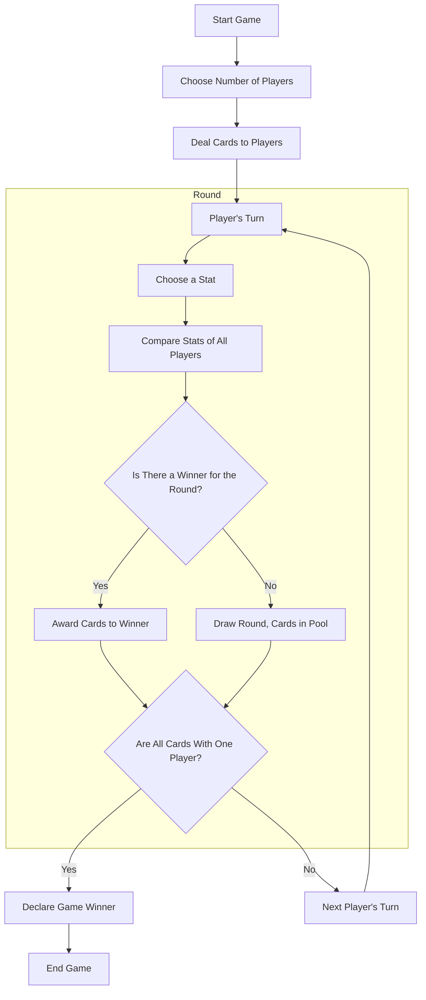

# top-trumps-caleb

## 🔧 Tech Stack

### Backend
- **Java & Spring Boot**: 
  - Core language and framework for managing the game logic, API development, and dependency injection to maintain clean, modular code.
  - Enabled **REST API** to handle game actions, such as starting a new game and comparing character attributes.
  - API endpoints tested for robustness using **Postman**.
- **MVC (Model-View-Controller) Architecture**:
  - **Model**: Represents game entities like `Character`, `Player`, `Game`, and `Deck`.
  - **View**: 
    - Local gameplay GUI built with Swing.
    - REST API serves external interactions.
  - **Controller**: Manages game flow, processes API requests, and updates the view.
- **Unit Testing**: Implemented using **JUnit** to test core gameplay methods and ensure reliability.
- **Environment Variables & Secure Configurations**: Sensitive credentials and configurations are securely managed for both local and cloud deployments.

### Frontend
- **Library**: React
- **Features**: Modular, interactive components for a seamless and engaging game interface.

### Database
- **Database**: MySQL
- **ORM**: JPA (Java Persistence API) with Spring Data JPA.
- **Functionality**:
  - Efficiently stores and manages character data.
  - **JPA annotations** simplify Object-Relational Mapping (ORM) and ensure data integrity during gameplay.

### Deployment and CI/CD
- **Docker**: Containerized application components for consistent deployment across environments.
- **Jenkins**: Set up a CI/CD pipeline to automate the process of building, testing, and deploying application updates.
- **AWS**: 
  - Hosting the application in the cloud, making it accessible via a dedicated URL.
  - Supports both backend APIs and frontend GUI for end-user interaction.
_______

A [Top Trumps](https://en.wikipedia.org/wiki/Top_Trumps) game based on characters from the Bible, made for my kids.

